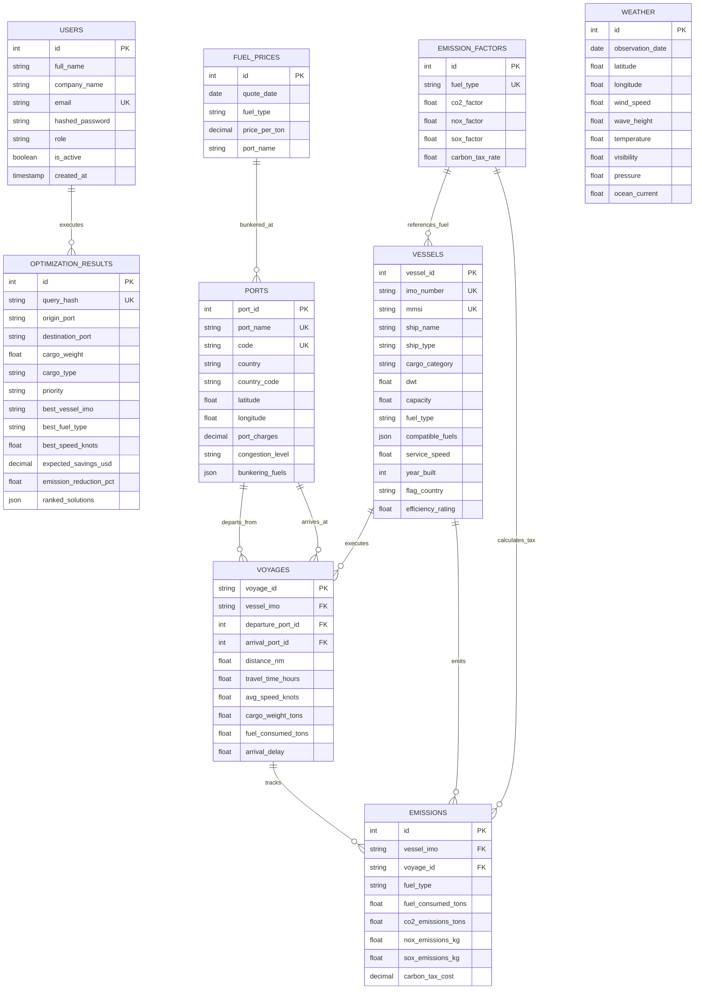

# QuantumFleet: Entity-Relationship Diagram & Data Dictionary

---

## 1. Entity-Relationship Diagram (Mermaid)

```mermaid
erDiagram
    USERS ||--o{ OPTIMIZATION_RESULTS : executes
    PORTS ||--o{ VOYAGES : departs_from
    PORTS ||--o{ VOYAGES : arrives_at
    VESSELS ||--o{ VOYAGES : executes
    VESSELS ||--o{ EMISSIONS : emits
    VOYAGES ||--o{ EMISSIONS : tracks
    EMISSION_FACTORS ||--o{ VESSELS : references_fuel
    EMISSION_FACTORS ||--o{ EMISSIONS : calculates_tax
    FUEL_PRICES ||--o{ PORTS : bunkered_at

    USERS {
        int id PK
        string full_name
        string company_name
        string email UK
        string hashed_password
        string role
        boolean is_active
        timestamp created_at
    }

    PORTS {
        int port_id PK
        string port_name UK
        string code UK
        string country
        string country_code
        float latitude
        float longitude
        decimal port_charges
        string congestion_level
        json bunkering_fuels
    }

    VESSELS {
        int vessel_id PK
        string imo_number UK
        string mmsi UK
        string ship_name
        string ship_type
        string cargo_category
        float dwt
        float capacity
        string fuel_type
        json compatible_fuels
        float service_speed
        int year_built
        string flag_country
        float efficiency_rating
    }

    VOYAGES {
        string voyage_id PK
        string vessel_imo FK
        int departure_port_id FK
        int arrival_port_id FK
        float distance_nm
        float travel_time_hours
        float avg_speed_knots
        float cargo_weight_tons
        float fuel_consumed_tons
        float arrival_delay
    }

    EMISSIONS {
        int id PK
        string vessel_imo FK
        string voyage_id FK
        string fuel_type
        float fuel_consumed_tons
        float co2_emissions_tons
        float nox_emissions_kg
        float sox_emissions_kg
        decimal carbon_tax_cost
    }

    EMISSION_FACTORS {
        int id PK
        string fuel_type UK
        float co2_factor
        float nox_factor
        float sox_factor
        float carbon_tax_rate
    }

    FUEL_PRICES {
        int id PK
        date quote_date
        string fuel_type
        decimal price_per_ton
        string port_name
    }

    WEATHER {
        int id PK
        date observation_date
        float latitude
        float longitude
        float wind_speed
        float wave_height
        float temperature
        float visibility
        float pressure
        float ocean_current
    }

    OPTIMIZATION_RESULTS {
        int id PK
        string query_hash UK
        string origin_port
        string destination_port
        float cargo_weight
        string cargo_type
        string priority
        string best_vessel_imo
        string best_fuel_type
        float best_speed_knots
        decimal expected_savings_usd
        float emission_reduction_pct
        json ranked_solutions
    }
```
